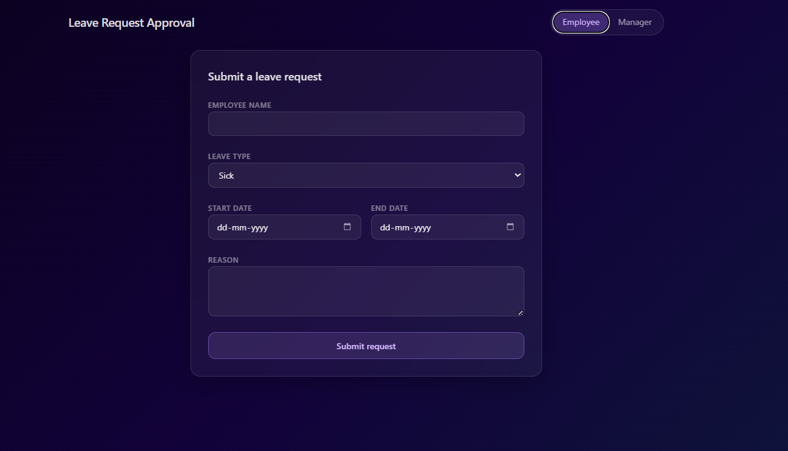
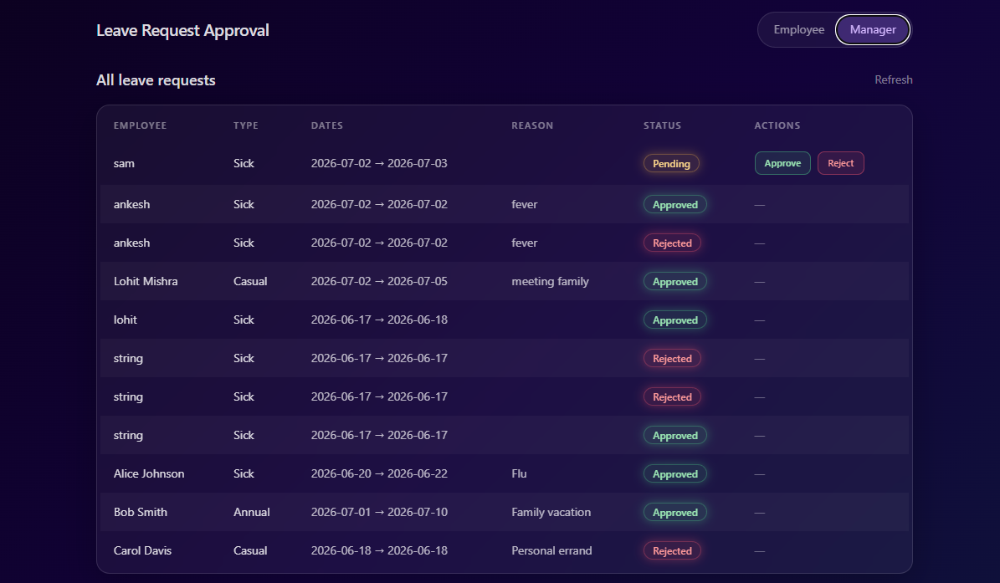
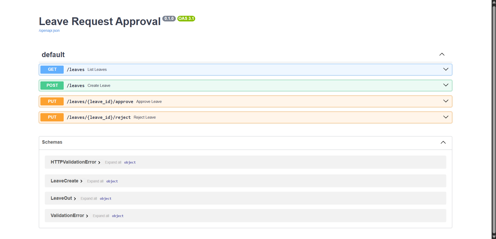

<div align="center">


# ✦ LEAVE MANAGEMENT SYSTEM ✦

### *AI-Generated Full-Stack Leave Request Approval Platform*


<br/>


<br/><br/>

**A Full-Stack Leave Request Approval System built with FastAPI, React, TypeScript and SQLite**

*This project was generated as a Proof of Concept (POC) using **Lovable AI** and demonstrates how AI can generate a functional full-stack CRUD application from a single prompt.*

</div>

<br/>

<div align="center">

</div>

<br/>

##  Overview

This project demonstrates a minimal **Leave Management System** where:

- Employees can submit leave requests.
- Managers can review submitted requests.
- Managers can approve or reject leave applications.
- Data is stored persistently using SQLite.
- Backend APIs are built using FastAPI.
- Frontend is built using React + TypeScript.

The objective of this repository is to evaluate how effectively **Lovable AI** can generate a complete full-stack application from a structured prompt.

<br/>

##  Features

<table>
<tr>
<td valign="top" width="50%">

### 🧑‍💼 Employee Portal

- Submit Leave Request
- Select Leave Type
- Choose Leave Duration
- Add Leave Reason

</td>
<td valign="top" width="50%">

### 🗂️ Manager Portal

- View all leave requests
- Approve pending requests
- Reject pending requests
- View request status

</td>
</tr>
</table>

### ⚙️ Backend


<br/>

##  Application Screenshots

<div align="center">

### Employee View



<br/><br/>

### Manager View



<br/><br/>

### FastAPI Swagger Documentation




</div>

<br/>

##  System Architecture

```
                     React + TypeScript (Frontend)

                           Employee / Manager UI
                                      │
                                      │
                                      ▼
                           REST API (Fetch Calls)
                                      │
                                      ▼
                         FastAPI Backend (main.py)
                                      │
                                      ▼
                          SQLAlchemy ORM Layer
                                      │
                                      ▼
                             SQLite Database
                                leave.db
```

<br/>

##  Project Structure

```
leave-management-system
│
├── backend
│   ├── main.py
│   ├── requirements.txt
│   └── leave.db
│
├── src
│
├── package.json
├── vite.config.ts
├── tsconfig.json
│
└── README.md
```

<br/>

##  Backend Workflow

The backend is implemented using **FastAPI**.

When the application starts:

```
FastAPI Starts
        │
        ▼
Creates SQLite Database
        │
        ▼
Creates leave_requests Table
        │
        ▼
Seeds 3 Sample Records
        │
        ▼
Starts REST APIs
```

<br/>

### Database Schema

Table:

```
leave_requests
```

| Column | Type |
|:----------|:---------|
| `id` | Integer |
| `employee_name` | String |
| `leave_type` | String |
| `start_date` | Date |
| `end_date` | Date |
| `reason` | String |
| `status` | String |
| `created_at` | DateTime |

**Status values:**


<br/><br/>

##  API Endpoints

| Method | Endpoint | Description |
|:---------|:-----------|:----------------|
|  | `/leaves` | Create Leave Request |
|  | `/leaves` | Retrieve All Leave Requests |
|  | `/leaves/{id}/approve` | Approve Leave |
|  | `/leaves/{id}/reject` | Reject Leave |

**Swagger Documentation**

```
http://127.0.0.1:8000/docs
```

<br/>

##  Frontend Workflow

<table>
<tr>
<td valign="top" width="50%">

**Employee Workflow**

```
Employee
    │
    ▼
Submit Form
    │
    ▼
POST /leaves
    │
    ▼
FastAPI
    │
    ▼
SQLite
    │
    ▼
Response
    │
    ▼
React Updates UI
```

</td>
<td valign="top" width="50%">

**Manager Workflow**

```
Manager
      │
      ▼
Fetch Leave Requests
      │
      ▼
GET /leaves
      │
      ▼
Approve / Reject
      │
      ▼
PUT API
      │
      ▼
Updated Status
```

</td>
</tr>
</table>

<br/>

##  Tech Stack

<table>
<tr>
<td valign="top" width="33%">

**Backend**
- Python
- FastAPI
- SQLAlchemy
- SQLite
- Uvicorn
- Pydantic

</td>
<td valign="top" width="33%">

**Frontend**
- React
- TypeScript
- TanStack Start
- Vite

</td>
<td valign="top" width="33%">

**Database**
- SQLite

</td>
</tr>
</table>

<br/>

##  Running the Project

### Step 1 — Clone Repository

```bash
git clone https://github.com/Lohit720/leave-management-system.git

cd leave-management-system
```

### Step 2 — Start Backend

```bash
cd backend

pip install -r requirements.txt

uvicorn main:app --reload
```

Backend will run at

```
http://127.0.0.1:8000
```

Swagger

```
http://127.0.0.1:8000/docs
```

### Step 3 — Start Frontend

Open a **new terminal**

```bash
cd leave-management-system

npm install

npm run dev
```

Frontend

```
http://localhost:8080
```

### Step 4 — Test Application

1. Open Employee View
2. Submit Leave Request
3. Switch to Manager View
4. Approve / Reject Request
5. Refresh
6. Status updates automatically

<br/>

##  Lovable Prompt Used

The application was generated using the following prompt.

> *(Paste the exact prompt here)*

```text
Build a simple Leave Request Approval app — POC only, keep it minimal.
 
━━━━━━━━━━━━━━━━━━━━━━━━
BACKEND — Python FastAPI
━━━━━━━━━━━━━━━━━━━━━━━━
Single file backend: backend/main.py
 
Use FastAPI + SQLite (no PostgreSQL setup needed for POC).
Use SQLAlchemy with a local SQLite file: leave.db
 
One table — leave_requests:
  id, employee_name, leave_type, start_date, end_date, reason, status, created_at
 
status values: pending | approved | rejected
 
API endpoints:
  POST /leaves          → submit a leave request (status = pending)
  GET  /leaves          → list all requests
  PUT  /leaves/{id}/approve  → set status to approved
  PUT  /leaves/{id}/reject   → set status to rejected
 
Enable CORS for http://localhost:5173
Include: requirements.txt with fastapi, uvicorn, sqlalchemy
 
━━━━━━━━━━━━━━━━━━━━━━━━
FRONTEND — React + TypeScript
━━━━━━━━━━━━━━━━━━━━━━━━
Two views only:
 
1. Employee view — a simple form to submit a leave request:
   - Employee name (text input)
   - Leave type (dropdown: Sick | Casual | Annual)
   - Start date, End date
   - Reason (textarea)
   - Submit button
 
2. Manager view — a table of all requests with:
   - Employee name, leave type, dates, reason, status badge
   - Approve / Reject buttons (only shown for pending requests)
 
Add a toggle at the top to switch between Employee view and Manager view.
 
Status badges: pending = amber, approved = green, rejected = red.
 
All API calls go to http://localhost:8000.
Use a single api.ts file for all fetch calls.
 
━━━━━━━━━━━━━━━━━━━━━━━━
KEEP IT SIMPLE
━━━━━━━━━━━━━━━━━━━━━━━━
- No auth, no login screen
- No complex folder structure — flat files are fine
- No migrations — just create tables on startup with SQLAlchemy
- Seed 3 sample leave requests on first run
```


<br/>

##  What Lovable Generated


<br/>

##  What Happens Behind the Scenes

```
User clicks Submit
        │
        ▼
React Form
        │
        ▼
fetch()
        │
        ▼
FastAPI Endpoint
        │
        ▼
SQLAlchemy ORM
        │
        ▼
SQLite Database
        │
        ▼
Response
        │
        ▼
React Updates Screen
```

<br/>

##  Future Improvements


<br/>

##  Purpose of this Project

This project was created to evaluate how effectively **Lovable AI** can generate a production-style full-stack application from a well-defined prompt.

It demonstrates AI-assisted development for:

- Backend API generation
- Database integration
- React frontend generation
- CRUD operations
- End-to-end application flow

<br/>

<div align="center">


##  Author

### **Lohit Mishra**


[https://github.com/Lohit720](https://github.com/Lohit720)

<br/>

### ⭐ If you found this project useful, consider giving it a star!


</div>
